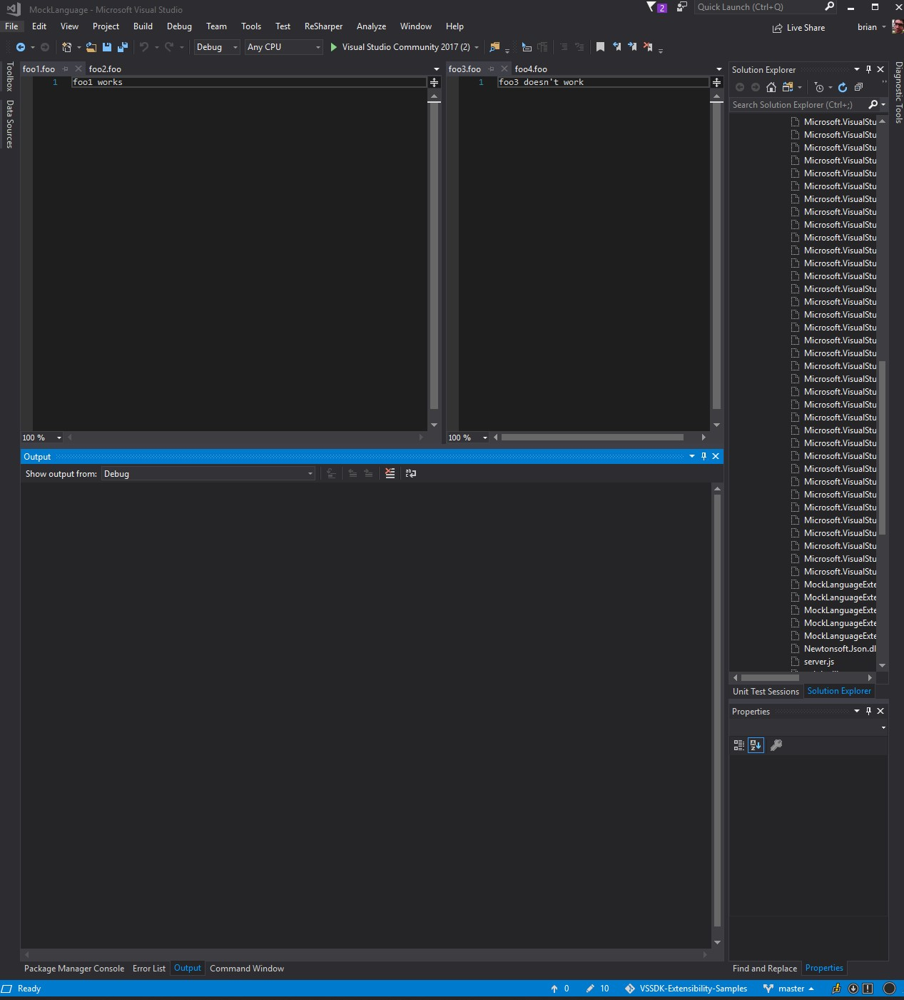

Shows an issue with split pane + LSP not activating the visible file in the right pane

To see ths issue, please watch screencast.mp4. it will show foo3.foo not receiving notifications from the server.

Background:

There is a simple server (js) that sends notifications on file open and change (server.js). It's being 
packaged up into a .exe with pkg (this is reproducable without pkg/exe, just have to ensure node_modules and 
server.js are in the vsix output, along with changing the path in FooLanguageClient.cs)

FooLanguageClient uses a CustomMessageTarget to Debug.Write the notifications received.

To replicate in your environment:

- clone this repo, and select MockLanguageExtension as the startup project.

- Ensure your editor has foo1 and foo2 open in the left pane, and foo3 and foo4 in the 
right pane. This part is important, as we're going to open the same solution in the 
experimental instance of visual studio (see below)

- you will see notifications in the Output->Debug window for all foo*.foo files except foo3.foo (which should be the first visible file in the right pane)

Building:

everything should be built, and ready to run, but if server.js needs to be rebuilt:

- `npm install` (from the MockLanguageExtension directory)
- `npm run package` (generates the server.exe from server.js)
- hit F5 to run